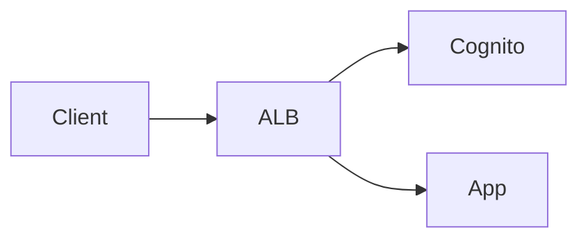

# Structured Content Format

Content blocks are embedded in subtopic `.md` files alongside questions. Each block opens with a `##` heading and ends at the next `##` or `###` heading.

## Header

```
## [phase:<tag>] Title
```

- `phase:*` — one of `phase:atomic`, `phase:complex`, `phase:integration`
- `title` — plain text; shown to the user

## Metadata lines

Follow the heading, before the blank line that separates them from the body. All are optional unless noted.

| Key | Default | Notes |
|-----|---------|-------|
| `type:` | `text` | `text`, `image`, `audio`, `video` — omit for text |
| `tags:` | — | Comma-separated; topic/skill/focus tags; phase is in heading, omit here |
| `src:` | — | Required for `image`, `audio`, `video`; primary media URL |
| `meta.<key>:` | — | Arbitrary metadata fields, mapped to `metadata` JSONB; any number of lines |

## Body

Follows the blank line after metadata. Supports full markdown including fenced blocks (e.g. Mermaid diagrams). For `image`/`audio`/`video`, the body is an optional caption or description.

---

## Examples

### text (default)

```markdown
## [phase:atomic] GuardDuty Threat Detection Fundamentals
tags: threat-detection, guardduty

Amazon GuardDuty is an intelligent threat detection service that analyzes VPC Flow
Logs, DNS logs, and CloudTrail events to identify malicious activity. It uses machine
learning and threat intelligence to detect threats like cryptocurrency mining, data
exfiltration attempts, and compromised credentials.
```

### text — with diagram

````markdown
## [phase:complex] Authentication Flow
tags: iam, auth

The following diagram shows how authentication is handled at the edge.



Cognito handles token validation before the request reaches the application.
````

### text — with metadata (e.g. language vocabulary)

```markdown
## [phase:atomic] Character: 看 (look/see/read)
tags: vocabulary, hsk1
meta.word: 看
meta.pinyin: kàn
meta.pos: verb
meta.strokeCount: 9
meta.cefrLevel: HSK1
meta.register: neutral

**看** (kàn) — 'Look', 'see', 'watch', or 'read'. A primary perception verb with
multiple meanings depending on context.
```

### image

```markdown
## [phase:complex] VPC Architecture
type: image
tags: vpc, networking
src: https://example.com/vpc-diagram.png

VPC showing public and private subnets with NAT gateway and internet gateway.
```

### audio

```markdown
## [phase:atomic] Pronunciation: 第一声 (First Tone)
type: audio
tags: tones, phonetics
src: https://example.com/tone1.mp3

The first tone is high and level, held steady throughout the syllable.
```

### video

```markdown
## [phase:complex] Setting Up GuardDuty
type: video
tags: guardduty, setup
src: https://example.com/guardduty-setup.mp4

Walkthrough of enabling GuardDuty in a single account and configuring SNS alerts.
```

---

## Parser rules

- Heading `## [phase:*] Title` opens a new content block
- Metadata lines are `key: value` pairs read top-to-bottom until the first blank line
- `meta.*` keys are collected into a single `metadata` object (dot stripped from key name)
- Body is everything after the first blank line, until the next `##` or `###` heading
- Body supports full markdown; fenced blocks are passed through as-is
