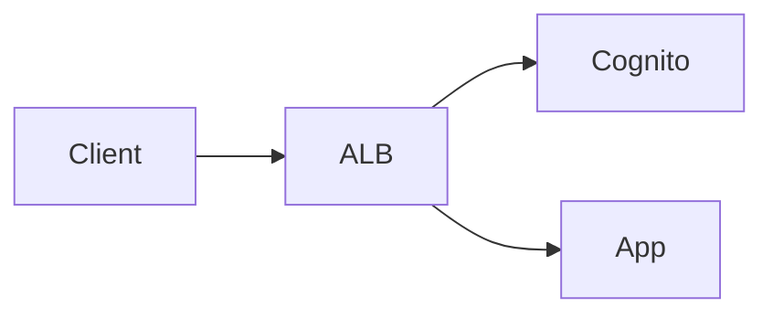

# Structured Question Format

Questions are embedded in subtopic `.md` files alongside content blocks. Each question opens with a `### question` heading and ends at the next `##` or `###` heading.

## Header

```
### question <type> [caseSensitive] difficulty:<n>
```

- `type` — one of `singleChoice`, `multiChoice`, `ordering`, `freeText`, `exactMatch`
- `caseSensitive` — optional flag, `exactMatch` only; omit for case-insensitive matching (default)
- `difficulty` — integer 0–4

## Tags

```
tags: phase:atomic, focus:translation
```

- Comma-separated
- Must include exactly one `phase:*` tag (`phase:atomic`, `phase:complex`, `phase:integration`)
- Topic/subject tags are inherited from the enclosing subtopic — omit them here
- Additional skill/focus tags are optional

## Question text

Follows `tags:` and supports full markdown including fenced blocks (e.g. Mermaid diagrams). The parser only matches option lines and `answer:` lines when **not** inside a fenced block.

## Options

Bare `key: text` lines immediately before the `answer:` line(s). 2–5 options, conventionally keyed `a`–`e`. Omitted for `freeText` and `exactMatch`.

## Answer

- `singleChoice` — single `answer:` line with one key
- `multiChoice` — single `answer:` line with concatenated keys, no separator (`answer: abc`)
- `ordering` — single `answer:` line with keys in correct sequence, no separator (`answer: bcad`)
- `freeText` — single `answer:` line with a plain-prose sample correct response (used as AI grading reference)
- `exactMatch` — one `answer:` line per accepted string; all lines are checked; no delimiter or escaping needed

## Explanation (optional)

```
explanation: <text>
```

A brief explanation shown to the user after answering. Supports inline markdown but not block elements (no fenced blocks, no headings).

**Use sparingly** — only for questions where the correct answer is genuinely counterintuitive, where a common misconception makes a wrong option plausible, or where the reasoning is not obvious from the question alone. The vast majority of questions should not have an explanation; if the question is well-written it should be self-evident why the answer is correct.

## show_with_content (optional)

```
show_with_content: true
```

Placed after the `tags:` line. When set to `true`, the body of the nearest preceding content block is copied into a `passage` field on the question and displayed above the question text at study time.

**When to use:** Only for genuine data-interpretation or reading-comprehension questions where the question is literally unanswerable without reading a specific table, chart, or text excerpt. Examples: "Based on the table above, which region had the highest growth?" or "According to the passage, what is the author's main claim?"

**Do not use** for ordinary recall or application questions that happen to follow a content block. If the question tests long-term knowledge (not immediate passage comprehension), it should be self-contained.

**Only valid** when the question is gated on a content block (i.e., it follows a `##` block, not placed ungated before the first `##`).

### Example

```markdown
## [phase:complex] Regional Sales Summary

tags: focus:data-analysis

| Region | Q1 | Q2 | Q3 | Q4 |
|--------|----|----|----|----|
| North  | 120 | 135 | 128 | 142 |
| South  | 98  | 102 | 115 | 109 |
| East   | 145 | 139 | 160 | 171 |

### question singleChoice difficulty:2
tags: phase:complex, focus:data-analysis
show_with_content: true
Based on the table, which region had the highest Q4 sales?
a: North
b: South
c: East
answer: c
```

---

## Examples

### singleChoice

```markdown
### question singleChoice difficulty:1
tags: phase:atomic
What is an IAM user?
a: An AWS account
b: An entity representing a person or application
c: A group of permissions
d: A temporary credential
answer: b
```

### singleChoice — true/false

```markdown
### question singleChoice difficulty:1
tags: phase:atomic
IAM roles use long-term static credentials.
a: True
b: False
answer: b
```

### singleChoice — assertion/reason

```markdown
### question singleChoice difficulty:3
tags: phase:integration
**Assertion:** IAM roles are preferred over IAM users for EC2 instances.
**Reason:** IAM roles provide temporary credentials that are automatically rotated.
a: Both assertion and reason are true, and the reason correctly explains the assertion
b: Both assertion and reason are true, but the reason does not explain the assertion
c: The assertion is true but the reason is false
d: The assertion is false but the reason is true
e: Both assertion and reason are false
answer: a
```

### singleChoice — with diagram

````markdown
### question singleChoice difficulty:2
tags: phase:complex
Given this flow, which component handles authentication?



a: ALB
b: Cognito
c: App
d: Client
answer: b
````

### singleChoice — with explanation

```markdown
### question singleChoice difficulty:2
tags: phase:complex
Which STS API call lets an IAM user assume a role in the same account?
a: AssumeRoleWithWebIdentity
b: AssumeRole
c: GetSessionToken
d: DecodeAuthorizationMessage
answer: b
explanation: `GetSessionToken` is for MFA-protected API calls, not role assumption. `AssumeRoleWithWebIdentity` is for federated web identities. `AssumeRole` works for same-account and cross-account role assumption.
```

### multiChoice

```markdown
### question multiChoice difficulty:2
tags: phase:complex
Which of the following are valid IAM principal types? (select all that apply)
a: IAM Users
b: IAM Groups
c: IAM Roles
d: IAM Policies
answer: abc
```

### ordering

```markdown
### question ordering difficulty:2
tags: phase:complex
Put the following steps in order to grant cross-account access using IAM roles:
a: Attach permission policies to the role
b: Create an IAM role in the target account
c: Define a trust policy specifying the source account
d: The user assumes the role via STS
answer: bcad
```

### freeText

```markdown
### question freeText difficulty:3
tags: phase:integration
Explain the difference between IAM roles and IAM users, and when you would use each.
answer: IAM users are long-term identities with static credentials assigned to people or applications. IAM roles are temporary identities assumed by trusted entities — used for cross-account access, EC2 instance profiles, Lambda execution, and identity federation.
```

### exactMatch — case-insensitive (default)

```markdown
### question exactMatch difficulty:1
tags: phase:atomic, focus:production
Type the Chinese character for "to see".
answer: 看
answer: 看见
answer: kàn
```

### exactMatch — case-sensitive

```markdown
### question exactMatch caseSensitive difficulty:1
tags: phase:atomic
Write a pipeline that counts lines.
answer: cat file | wc -l
answer: wc -l < file
```

---

## Grading

| Type | Method |
|------|--------|
| `singleChoice` | Exact key match |
| `multiChoice` | Set equality of selected keys vs answer keys |
| `ordering` | Exact sequence match |
| `freeText` | AI-graded; `answer:` is a sample correct response used as reference |
| `exactMatch` | Whitespace-trimmed string match against accepted list; case-insensitive unless `caseSensitive` flag present |
